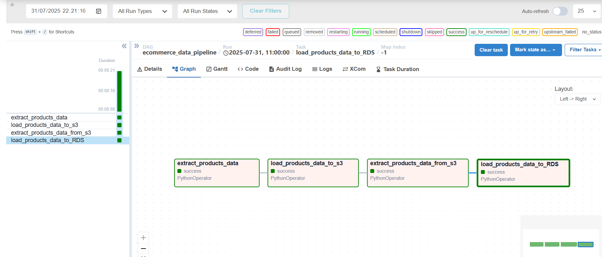
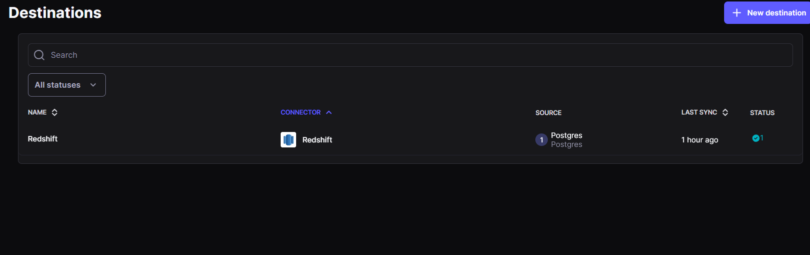

# ecommerce-data-pipeline

This project demonstrates a production-grade data pipeline built using **Airflow** and **Airbyte** to extract e-commerce product data from a public API, store it in **Amazon S3**, load it into **PostgreSQL RDS**, and finally sync the data into **Amazon Redshift**.

---

## Architecture Overview

# API ➜ Airflow ➜ S3 (Parquet) ➜ RDS (PostgreSQL) ➜ Airbyte ➜ Redshift

**Tools Used:**
- **Apache Airflow** (Dockerized)
- **AWS S3** – Data Lake storage
- **PostgreSQL RDS** – Intermediate structured storage
- **Amazon Redshift** – Data warehouse
- **Airbyte** (Minikube) – ELT sync from RDS to Redshift
- **Python + pandas + awswrangler** – For ETL logic

---

## Project Structure

```bash
ecommerce-data-pipeline/
    airflow
    ├── dags/
    │ └── api_to_rds_dag.py # Airflow DAG definition
    │ └── api_to_rds.py # ETL functions (API, S3, RDS)
    │
    ├── Dockerfile # Airflow environment setup
    ├── docker-compose.yaml # Airflow + dependencies
    ├── requirements.txt # Python dependencies
    infrastructure/
    │   ├── terraform/                    # Terraform configuration
    │       ├── redshift.tf              # Redshift cluster setup
    │       ├── s3.tf                    # S3 bucket provisioning
    │       ├── providers.tf             # AWS provider
    │       ├── backend.tf               # Backend config
    ├── .gitignore
    └── README.md # Project documentation
```

## Step-by-Step Pipeline Description

### 1. **API to S3**
- Airflow fetches product data from a public e-commerce API.
- Data is cleaned and normalized using `pandas`.
- Data is saved to S3 as a `.parquet` file using `awswrangler`.

### 2. **S3 to RDS (PostgreSQL)**
- The `.parquet` file is read from S3.
- Data is loaded into a table called `products` in an RDS PostgreSQL instance.

### 3. **RDS to Redshift (via Airbyte)**
- Airbyte is configured on **Minikube**.
- A source connector is set up for RDS PostgreSQL.
- A destination connector is set up for Amazon Redshift.
- Airbyte syncs data automatically or on demand.

---

## How to Run the Project

### 1. **Clone the Repo**
```bash
git clone https://github.com/your-username/ecommerce-data-pipeline.git
cd ecommerce-data-pipeline
```

### 2. Set Up Airflow (Docker)
```bash
docker-compose up airflow-init
docker-compose up
```

### 3. Set Your Airflow Variables
```bash
ACCESS_KEY, SECRET_KEY, DB_NAME, USERNAME, PASSWORD, HOST, PORT, S3 Bucket path
```

### 4. Trigger the DAG
Once all variables are configured:
Go to Airflow UI (http://localhost:8080)
Trigger the DAG: ecommerce_data_pipeline

## Airbyte Setup (Minikube)
- Start Minikube and expose port
- minikube start
- minikube service airbyte-webapp-service --url
- Open the Airbyte UI
### Create:
- Source: PostgreSQL (RDS)
- Destination: Amazon Redshift
- Connection: Select products table and configure sync
- Run manual sync to transfer data.



